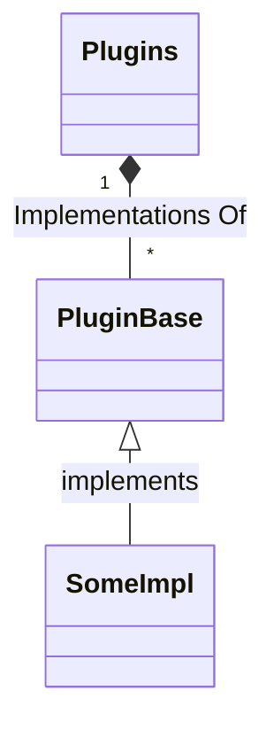

- [Field Notes for Plugins Concept](#field-notes-for-plugins-concept)
- [Basic Thinking](#basic-thinking)
- [Digging a little deeper](#digging-a-little-deeper)
  - [When Infrastructure and Application development develop on separate stream](#when-infrastructure-and-application-development-develop-on-separate-stream)
  - [When Infrastructure and Application development become tied to the hip](#when-infrastructure-and-application-development-become-tied-to-the-hip)

# Field Notes for Plugins Concept

I am considering the best way to make this tool more flexible to support different kinds of Infrastructure, each with their flavor of deployment recipes.

For example, AWS have CloudFormation, SAM templates and Amplify which can all be used to deploy resources and applications. On the other hand, platforms like Kubernetes have tools like `kubectl apply` and Helm Charts for deploying applications.

# Basic Thinking

The application needs to be provided a directory where plugins are installed.

Said plugins can be install by `pip` from a URL to the target directory.

Then, through some configuration, the application must scan the plugins directory and register all the plugins.

In turn, each plugin will register as a handler of some manifest `Kind` and bound to supported versions of that kind.

Basic concept:

# Digging a little deeper

In the current model we have two high level concepts that ties together:

1. We have the concepts of target systems (the system itself and how we authenticate to it)
2. Then we have Projects, which will contain the deployment definitions and tasks that target the above mentioned systems.

There is also a concept of an environment, which does not have any real hard definition. We can also think of it as a scope. Environments loosely groups systems and projects together. Lets take a very simple example of having a staging and a production environment. We can isolate these two environments and ensure while we are in a development phase we only deploy to resources in the scope of the staging environment. Only when we are ready for pushing our changes to production can we target resources scoped for production.

However, we should not forget that infrastructure development and application development may sometimes follow separate paths, while at other times be very closely tied together.

## When Infrastructure and Application development develop on separate stream

These are situations where a team of infrastructure engineers maintains servers and services supporting the hosting of an application, where there may be very limited or almost no dependency of the application development and the infrastructure development and maintenance. 

For example, a team my maintain a number of web servers, with DNS, load balancers etc. completely separate from the development team(s) developing the application being hosted on those servers.

The `verba-cratis` tool can be used in this scenario in two different roles:

1. The first is purely for the infrastructure engineers to maintain deploy and maintain the servers, DNS and all other infrastructure related objects.
2. The second is where some minor updates must be made to infrastructure, like DNS or reverse proxy configuration, with certain application deployments

The infrastructure and application source code repositories are completely separate in this scenario. The subtle changes required in infrastructure for application support, like DNS, reverse proxy configuration and such can still easily be maintained in separate repositories.

There is also separated streams between the Infrastructure development and application development efforts. Infrastructure evolves more in a Kanban type fashion (ship it when it's ready) while application development may be more sprint or even waterfall driven. This is typically why there are two separate repositories for Infrastructure and application development and code reviews, merges and other tasks in the various development life cycles happen independent of each other and only a small amount of coordination is required between the two teams for certain infrastructure aspects as already pointed out.

## When Infrastructure and Application development become tied to the hip

Then there are other scenarios where infrastructure and application and strongly intertwined. Examples like AWS Amplify or AWS Serverless come to mind where application logic and Infrastructure evolve in parallel and are directly dependant on one another.

In these scenarios I still see two separate repositories for infrastructure and application development as there is still a "base" or "common" Infrastructure layer. This includes perhaps things like AWS VPC configuration, AWS ACM etc. which can be developed and maintained separate from the application. The application may rely or even reference on these systems, but do not need to exercise any direct control over hem during their own development and deployment. 

However, there are a lot of infrastructure components that is directly controlled by the application development effort and these components are typically in the application source code repository.

Basically, we still have elements that look like the first scenario and follow the same life cycles, but then we also have application and infrastructure that follow the same processes and life in the same repository.

At the root, there is still two roles for the `verba-cratis` tool as defined in the previous scenario, but there is a lot more release activities that need to be coordinated on a continuos basis.

Through a combination of `Projects` and `Environments`, there can still be a well defined separation between what Infrastructure is purely base/common and what Infrastructure is tied to the application development. 

In the example of AWS Amplify or serverless, the `verba-cratis` tool should be more concerned about how to deploy the these application projects through their templates. Therefore, the deployment portion focus on knowing how to deploy the templates and in reality does not really care too much about what Infrastructure is deployed, but just know it is deployed on top of some base Infrastructure layer (VPC, certificates etc.) that is maintained separately.

