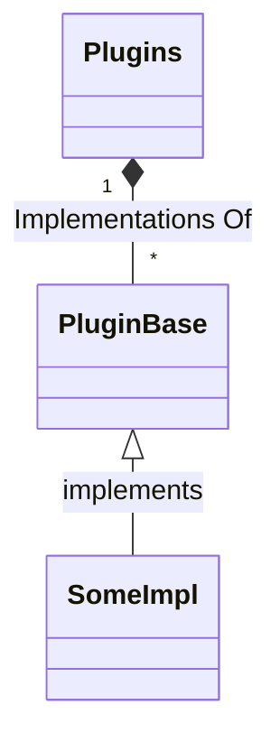

- [Field Notes for Plugins Concept](#field-notes-for-plugins-concept)
- [Basic Thinking](#basic-thinking)

# Field Notes for Plugins Concept

I am considering the best way to make this tool more flexible to support different kinds of Infrastructure, each with their flavor of deployment recipes.

For example, AWS have CloudFormation, SAM templates and Amplify which can all be used to deploy resources and applications. On the other hand, platforms like Kubernetes have tools like `kubectl apply` and Helm Charts for deploying applications.

# Basic Thinking

The application needs to be provided a directory where plugins are installed.

Said plugins can be install by `pip` from a URL to the target directory.

Then, through some configuration, the application must scan the plugins directory and register all the plugins.

In turn, each plugin will register as a handler of some manifest `Kind` and bound to supported versions of that kind.

Basic concept:

