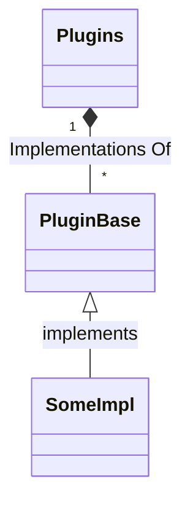

- [Field Notes for Plugins Concept](#field-notes-for-plugins-concept)
- [Basic Thinking](#basic-thinking)
- [Digging a little deeper](#digging-a-little-deeper)

# Field Notes for Plugins Concept

I am considering the best way to make this tool more flexible to support different kinds of Infrastructure, each with their flavor of deployment recipes.

For example, AWS have CloudFormation, SAM templates and Amplify which can all be used to deploy resources and applications. On the other hand, platforms like Kubernetes have tools like `kubectl apply` and Helm Charts for deploying applications.

# Basic Thinking

The application needs to be provided a directory where plugins are installed.

Said plugins can be install by `pip` from a URL to the target directory.

Then, through some configuration, the application must scan the plugins directory and register all the plugins.

In turn, each plugin will register as a handler of some manifest `Kind` and bound to supported versions of that kind.

Basic concept:

# Digging a little deeper

In the current model we have two high level concepts that ties together:

1. We have the concepts of target systems (the system itself and how we authenticate to it)
2. Then we have Projects, which will contain the deployment definitions and tasks that target the above mentioned systems.

There is also a concept of an environment, which does not have any real hard definition. We can also think of it as a scope. Environments loosely groups systems and projects together. Lets take a very simple example of having a staging and a production environment. We can isolate these two environments and ensure while we are in a development phase we only deploy to resources in the scope of the staging environment. Only when we are ready for pushing our changes to production can we target resources scoped for production.

